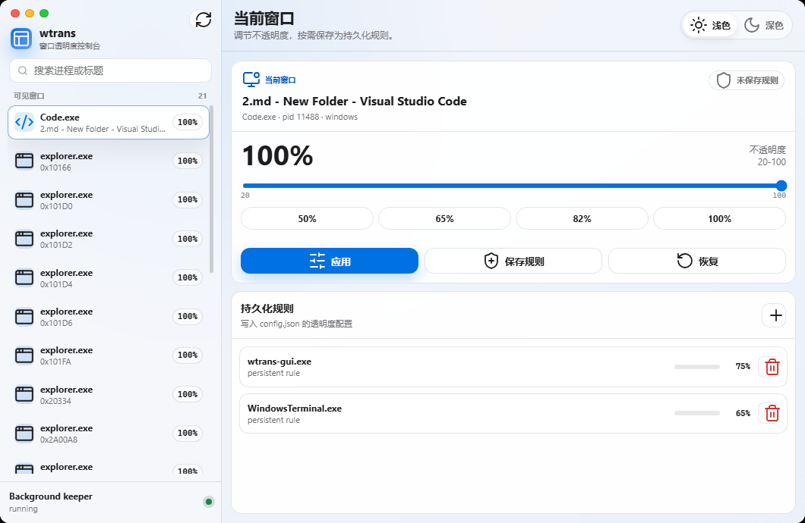

**English** | **[简体中文](README.md)**

# 🪟 wtrans — Window Transparency Tool

## 📸 Screenshots



wtrans GUI Console: visible window list on the left, opacity slider and persistence rules on the right
<!-- runtime-screenshots:end -->


<p align="center">
  
  
  
  
</p>

> Cross-platform window transparency tool — control the opacity of any application window via Win32 API and X11/Wayland

wtrans is a pure Go command-line window transparency manager with zero third-party dependencies. On Windows it operates directly through Win32 APIs; on Linux it supports four backends — X11, Sway, Hyprland, and GNOME Wayland. It lets you set, restore, and batch-manage the opacity of any visible window, making it ideal for developers and power users who work with multiple windows side by side.

<br/>

## ✨ Core Features

- **🪟 Window Opacity Control** — Set any visible window's opacity from 20% to 100% with precision
- **📋 Window Listing** — List all visible windows showing window ID, PID, process name, title, and backend
- **🔄 One-Click Restore** — Restore windows to fully opaque with intelligent style cleanup
- **📦 Batch Configuration** — Apply opacity rules to multiple processes via a JSON config file
- **🔍 Process Filtering** — Filter by process name and window class, case-insensitive matching
- **⚙️ Smart Style Management** — Automatically handles window extended styles; preserves original attributes on restore
- **🛡️ Non-Destructive** — Reads existing attributes before modifying, avoids overwriting original window config
- **🖥️ Multi-Backend Support** (Linux) — Auto-detects X11, Sway, Hyprland, and GNOME Wayland desktop environments
- **🔧 Diagnostics** — One command to inspect your session, detected backend, and tool dependencies
- **📦 Zero External Dependencies** — Built entirely with the Go standard library
- **🧪 Full Test Coverage** — Unit tests for all core packages

<br/>

## 🚀 Quick Start

### Installation
```bash
# Clone the repository
git clone https://github.com/ll31415926/windows-transparent.git

# Enter the project directory
cd windows-transparent

# Build the CLI
go build -o wtrans ./cmd/wtrans

# Build the GUI (recommended when Wails CLI is installed)
wails build

# If the wails command is not available, use the equivalent Go build command
go build -tags "desktop,production" -ldflags "-w -s -H windowsgui" -o wtrans-gui.exe ./cmd/wtrans-gui

# Verify the CLI
./wtrans -h

# Optional: use the beginner-friendly menu
# Windows: wtrans-setup.bat
# Linux: ./wtrans-setup.sh
```

### Basic Usage
```bash
# List all visible windows
./wtrans list

# Filter windows by process name
./wtrans list --process Code.exe

# Set a window's opacity to 65%
./wtrans set --process notepad.exe --opacity 65

# Set and keep newly opened matching windows at the same opacity
./wtrans set --process notepad.exe --opacity 65 --persist

# Restore a window to fully opaque
./wtrans restore --process notepad.exe

# Check saved rules and whether the background keeper is running
./wtrans status

# Stop the background keeper without removing saved rules
./wtrans stop

# Clear all saved rules and stop the background keeper
./wtrans reset

# Apply opacity rules from a config file
./wtrans apply --config config.json

# Diagnose your environment (very useful on Linux)
./wtrans diagnose
```

<br/>

## 🛠️ Command Reference

### list
List all visible windows, optionally filtered by process name.

| Flag | Description | Example |
|------|-------------|---------|
| `--process` | Filter by process name (optional, case-insensitive) | `--process explorer.exe` |

```bash
# List all visible windows
./wtrans list

# List all Chrome windows
./wtrans list --process chrome.exe
```

**Windows output:**
```
      HWND        PID  PROCESS              TITLE
  0x1A0234       1234  explorer.exe         Taskbar
  0x5B0C68       5678  Code.exe             main.go - windows-transparent
  0x3D0F12       9012  notepad.exe          Untitled - Notepad
```

**Linux output:**
```
         ID        PID  PROCESS       BACKEND   TITLE
  0x3a00006       1234  firefox       x11       Mozilla Firefox
  0x4200003       5678  code          x11       main.go - windows-transparent
  0x5c0001a       9012  gnome-terminal gnome     Terminal
```

### set
Set the opacity for all visible windows matching a process name.

| Flag | Description | Example |
|------|-------------|---------|
| `--process` | Target process name (required, case-insensitive) | `--process Code.exe` |
| `--opacity` | Opacity percentage, range 20–100 (required) | `--opacity 75` |
| `--persist` | Save the rule and start a background watcher so newly opened matching windows keep the same opacity | `--persist` |

```bash
# Set VS Code to 85% opacity
./wtrans set --process Code.exe --opacity 85

# Make Notepad semi-transparent
./wtrans set --process notepad.exe --opacity 50

# Keep future Notepad windows at 65% opacity until restored
./wtrans set --process notepad.exe --opacity 65 --persist
```

### restore
Restore the specified process windows to fully opaque (100%). If a saved keep-transparent rule exists, it is removed too.

| Flag | Description | Example |
|------|-------------|---------|
| `--process` | Target process name (required, case-insensitive) | `--process Code.exe` |

```bash
# Restore VS Code to fully opaque
./wtrans restore --process Code.exe
```

### status
Show the config path, saved rules, and whether the background keeper is running.

```bash
./wtrans status
./wtrans status --config rules.json
```

### stop
Stop the background keeper but keep all saved rules.

```bash
./wtrans stop
```

### reset
Stop the background keeper, clear all saved rules, and restore any visible matching windows when possible.

```bash
./wtrans reset
```

### apply
Load a JSON config file and apply all opacity rules.

| Flag | Description | Example |
|------|-------------|---------|
| `--config` | Config file path (optional) | `--config rules.json` |

**Default config path:**
- **Windows:** `%APPDATA%\wtrans\config.json`
- **Linux:** `~/.config/wtrans/config.json`

```bash
# Use the default config file
./wtrans apply

# Specify a config file path
./wtrans apply --config /home/user/my_rules.json
```

### watch
Continuously apply rules from the default or specified config file. This is started automatically by `set --persist`, but can also be run manually.

| Flag | Description | Example |
|------|-------------|---------|
| `--config` | Config file path (optional) | `--config rules.json` |

```bash
./wtrans watch
./wtrans watch --config rules.json
```

### diagnose
Print diagnostic information about the current desktop session. Extremely useful for troubleshooting Linux issues.

```bash
./wtrans diagnose
```

**Linux output example:**
```
Session:
  XDG_SESSION_TYPE=wayland
  XDG_CURRENT_DESKTOP=sway
  DISPLAY=
  WAYLAND_DISPLAY=wayland-1
  DBUS_SESSION_BUS_ADDRESS=unix:path=/run/user/1000/bus

Detected backend: sway

Tools:
  wmctrl: not found
  xprop: not found
  swaymsg: /usr/bin/swaymsg
  hyprctl: not found
  gdbus: /usr/bin/gdbus
  gnome-extensions: not found
```

### gnome-extension (Linux GNOME only)
Manage the GNOME Shell extension required for window transparency on GNOME Wayland.

| Subcommand | Description |
|------------|-------------|
| `install` | Auto-install the wtrans GNOME Shell extension |
| `status` | Show extension installation and enable status |

```bash
# Install the GNOME Shell extension
./wtrans gnome-extension install

# Check extension status
./wtrans gnome-extension status
```

> **Note:** After installing the extension, you must log out and back in, or restart GNOME Shell (press `Alt+F2`, type `r`) for it to take effect.

<br/>

## 📄 Configuration File

### Format
The config file is a JSON document containing a `rules` array. Each rule specifies a process name and a target opacity.

```json
{
  "rules": [
    { "process": "notepad.exe", "opacity": 65 },
    { "process": "Code.exe", "opacity": 85 },
    { "process": "firefox", "opacity": 90 },
    { "process": "gnome-terminal", "opacity": 80 }
  ]
}
```

### Fields
| Field | Type | Required | Description |
|-------|------|----------|-------------|
| `rules` | array | Yes | List of opacity rules |
| `rules[].process` | string | Yes | Process name, case-insensitive |
| `rules[].opacity` | integer | Yes | Opacity percentage, range 20–100 |

<br/>

## 📊 Usage Examples

### 1. Everyday Use
```bash
# See all current windows
./wtrans list

# Make the terminal semi-transparent to reference another window
./wtrans set --process gnome-terminal --opacity 60

# Restore when done
./wtrans restore --process gnome-terminal
```

### 2. Multi-Window Management
```bash
# Make multiple apps semi-transparent at once
./wtrans set --process firefox --opacity 80
./wtrans set --process Code.exe --opacity 85
./wtrans set --process notepad.exe --opacity 65

# Restore all
./wtrans restore --process firefox
./wtrans restore --process Code.exe
./wtrans restore --process notepad.exe
```

### 3. Batch Config File
```bash
# Create a config file
cat > my_rules.json << 'EOF'
{
  "rules": [
    { "process": "Code.exe", "opacity": 85 },
    { "process": "notepad.exe", "opacity": 65 },
    { "process": "firefox", "opacity": 90 }
  ]
}
EOF

# Apply in batch
./wtrans apply --config my_rules.json
```

### 4. Linux Troubleshooting
```bash
# Check diagnostics to confirm backend and tool readiness
./wtrans diagnose

# GNOME Wayland users: install the extension
./wtrans gnome-extension install
./wtrans gnome-extension status

# Force a specific backend (overrides auto-detection)
WTRANS_BACKEND=x11 ./wtrans list
```

<br/>

## 🔧 Technical Details

### Windows Implementation
- **Win32 API** — Calls `EnumWindows`, `SetLayeredWindowAttributes`, and related APIs directly via `user32.dll` / `kernel32.dll`
- **Layered Window Handling** — Intelligently manages the `WS_EX_LAYERED` extended style; preserves original attributes on restore
- **Process Resolution** — Uses `CreateToolhelp32Snapshot` to map PIDs to process names

### Linux Backends
| Backend | Tool Dependencies | Description |
|---------|-------------------|-------------|
| **X11** | `wmctrl`, `xprop` | Controls opacity via the `_NET_WM_WINDOW_OPACITY` X property |
| **Sway** | `swaymsg` | Uses IPC to call `swaymsg opacity` commands |
| **Hyprland** | `hyprctl` | Sets `alpha` and `alphainactive` window properties |
| **GNOME Wayland** | `gdbus`, GNOME Shell extension | Communicates with a custom GNOME Shell extension over D-Bus |

**Backend auto-detection priority:**
1. `WTRANS_BACKEND` environment variable (forced override)
2. Hyprland detected (`HYPRLAND_INSTANCE_SIGNATURE` set)
3. Sway detected (`SWAYSOCK` set)
4. `XDG_CURRENT_DESKTOP` contains a known desktop name
5. `XDG_SESSION_TYPE` value (`x11` or `wayland`)
6. Fallback: check for available tools in `PATH`

### Common
- **Zero external dependencies** — Uses only the Go standard library
- **Cross-platform builds** — Go build tags isolate platform-specific code
- **Testable architecture** — The `runner` interface abstracts external command execution for unit testing
- **Process matching** — Case-insensitive, matches both process name and window class name

### Error Handling
- **Dual error types** — `UsageError` (bad arguments, exit code 2) and regular errors (exit code 1)
- **Detailed messages on Linux** — Includes environment detection results and suggested fixes
- **Cross-platform fallback** — Unsupported platforms return `ErrUnsupported`

### Test Coverage
| Package | Tests | Coverage |
|---------|-------|----------|
| `cli` | 7 | Command parsing, argument validation, error handling |
| `config` | 4 | Config parsing, validation, save round-trip |
| `opacity` | 4 | Alpha conversion, boundary values |
| `window` (common) | 2 | Process matching, case handling |
| `window` (Linux) | 15+ | Backend detection, X11/Sway/Hyprland/GNOME command construction, output parsing |

<br/>

## 📌 Important Notes

### Windows
- **Admin privileges** — Some system windows (e.g., Task Manager) may require administrator privileges to modify
- **Process names** — Must include the file extension (e.g., `notepad.exe`)

### Linux
- **X11 sessions** — Requires `wmctrl` and `xprop` (`sudo apt install wmctrl x11-utils`)
- **Sway** — Requires `swaymsg` (usually bundled with Sway)
- **Hyprland** — Requires `hyprctl` (usually bundled with Hyprland)
- **GNOME Wayland** — Requires the GNOME Shell extension; run `./wtrans gnome-extension install` then log back in
- **KDE/KWin** — Not supported; KDE on Wayland does not allow external opacity control
- **Troubleshooting** — Run `./wtrans diagnose` to inspect your environment and tool dependencies

### General
- **Opacity range** — Limited to 20–100; values below 20% may make windows hard to interact with
- **Immediate effect** — Opacity changes take effect instantly, no app restart needed
- **Persistence** — Use `set --persist` to keep applying a rule to newly opened matching windows; use `restore --process ...` to remove that persistent rule
- **Beginner mode** — Use `wtrans-setup.bat` on Windows or `./wtrans-setup.sh` on Linux for a simple menu
- **Environment variable** — Use `WTRANS_BACKEND` to force a specific backend (e.g., `WTRANS_BACKEND=x11`)

<br/>

## ⚠️ Disclaimer

**Please read and agree to the following before using this tool:**

1. **Legal use only** — Use only on systems you have authorized access to
2. **System safety** — Avoid setting excessively low opacity on critical system windows
3. **Data privacy** — This tool does not collect or transmit any user data
4. **Use at your own risk** — The user assumes all responsibility for any consequences of using this tool
5. **Backup recommendation** — Test on a single window first before applying batch rules

<br/>

## 🤝 Contributing

Issues and Pull Requests are welcome!

```

---

**Every window, just right** — Take control of your workspace 🪟
